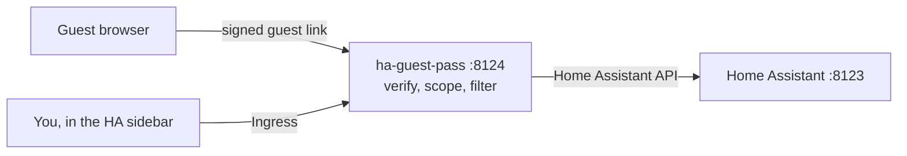

<p align="center">
  
</p>

# HA Guest Pass

[](https://github.com/ahmadelsayed97/ha-guest-pass/actions/workflows/ci.yml)
[](https://github.com/ahmadelsayed97/ha-guest-pass/releases)
[](LICENSE)

Scoped, password-free guest access to your Home Assistant dashboards. Hand a
guest a link or a QR code and they can use the rooms and devices you picked
until it expires. Nothing else in your Home Assistant is reachable from that
link, and your credentials never leave the proxy.

Home Assistant can hide an entity in the UI, but it still serves that entity
over the API. This proxy sits in front and enforces the boundary for real.



Guests reach the proxy and nothing else. Every WebSocket message and HTTP
request is checked against that guest's scope before it reaches Home
Assistant, and everything coming back is filtered to the same scope. Links are
signed, expire, and can be revoked. Connections from outside the LAN are
refused by socket address. Exact rules:
[docs/enforcement.md](docs/enforcement.md).

## Install as a Home Assistant add-on

Needs Home Assistant OS or Supervised. Tested against Home Assistant 2026.9.

1. Add this repository to your add-on store:

   [](https://my.home-assistant.io/redirect/supervisor_add_addon_repository/?repository_url=https%3A%2F%2Fgithub.com%2Fahmadelsayed97%2Fha-guest-pass)

   Or by hand: Settings → Add-ons → Add-on store → ⋮ → Repositories → add
   `https://github.com/ahmadelsayed97/ha-guest-pass`
2. Install **HA Guest Pass** and start it. Nothing to configure.
3. Open **Guest Pass** from the Home Assistant sidebar. You are already
   signed in.

## Creating a guest

Pick a name, a duration, the dashboards the guest may open, and for each area
whether the guest can view or control it. Every entity in a chosen area then
appears, grouped by device, with its own off, view or control switch, so
exceptions are one click; anything outside those areas can be added by name.
Create gives you a link and a QR code to hand over. Revoke closes the guest's
open connections immediately. Renew gives an ended guest a new link with the
same access; the old link stays dead.

The scope is fixed when the guest is created. A device you add to an area
later is not visible to existing guests.

The guest's token rides in the URL fragment, so it never reaches the server or
its logs. Guests see a countdown during their last ten minutes and a plain
"access has ended" page afterwards.

## Run from source

Bun 1.4 or newer.

```sh
cp .env.example .env   # HA_URL, HA_TOKEN, SIGNING_KEY, ADMIN_SECRET
bun install
bun start
```

Or build the `Dockerfile` and run it with `--network host` and a volume at
`/data`. Host networking is not optional: the LAN check and the per-address
lockout both need to see real client addresses.

## License

MIT. See [LICENSE](LICENSE).
